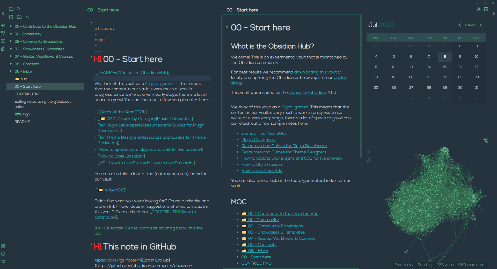
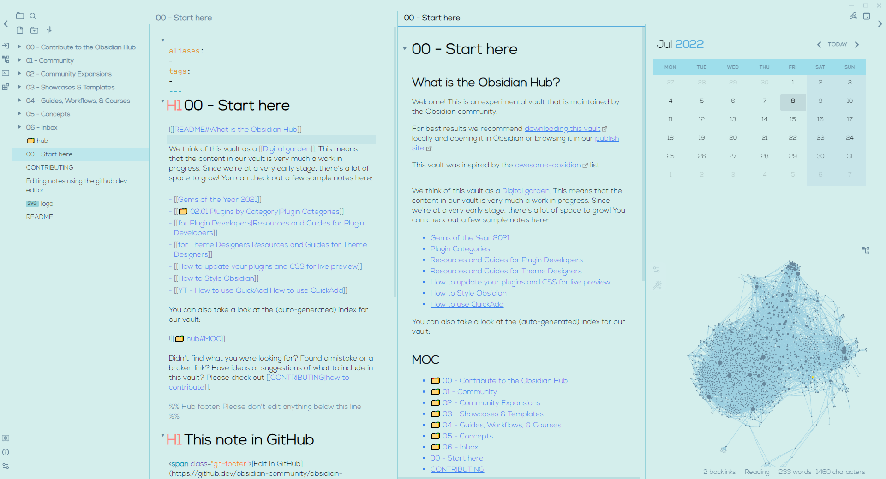
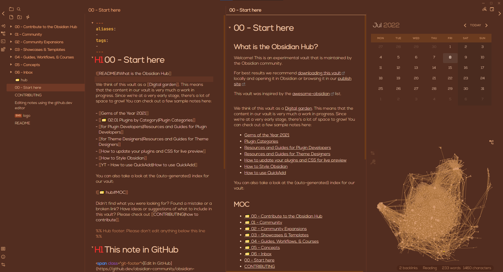
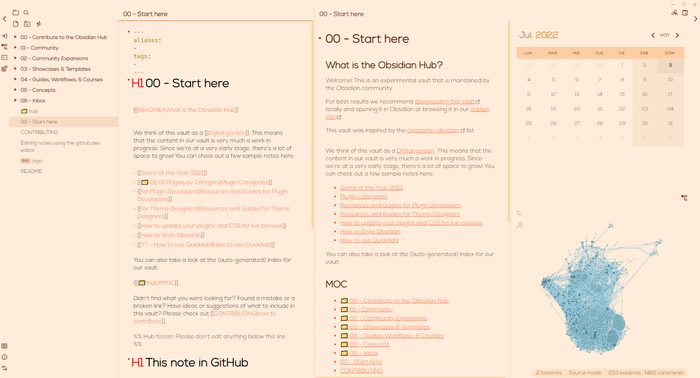
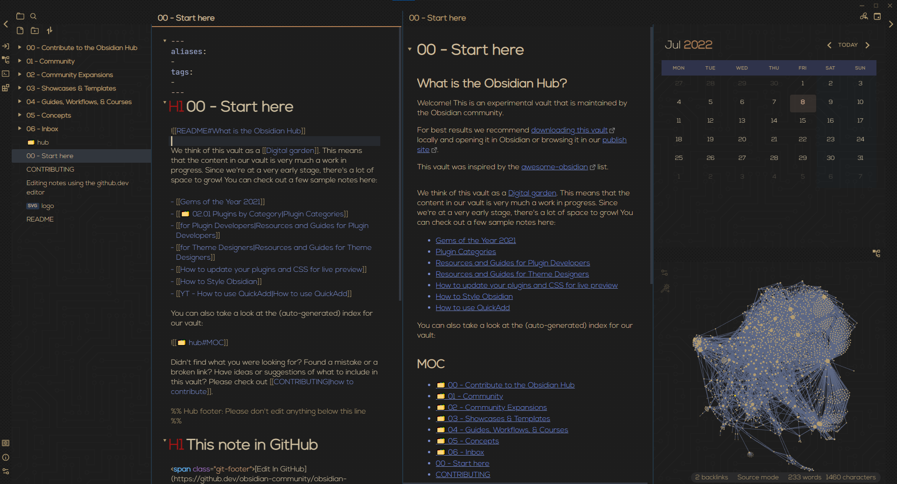

<h1 align=center>Home Page</h1>

Welcome to the mini Ukiyo "Wiki". Here you'll find all the changes and features that I made into the theme so that you can understand whats different and what to expect when using it.

The main goal for this theme was to hide all the unnecessary elements that either I don't use on a daily basis or that I can use that feature through shortcuts.

Also, I encountered a problem while building the previews themes that pushed me into making and *All-In-One* theme, so that it's easier for me to update and fix issues that, more often that not, are repeated in all the themes, since one was made using the previews as base. 

As I said on the GitHub Repository, I'm more that happy to hear any feedback and feature request. I hope you enjoy the theme as much as I do :smile:

## Showcase
### Ukiyo

### Golden Coffee

### Golden Book

### Alchemy

